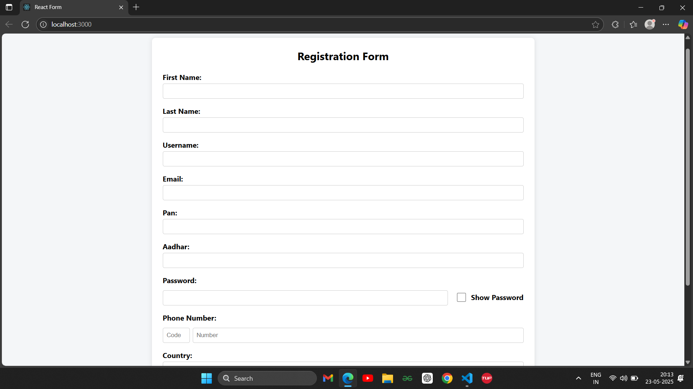
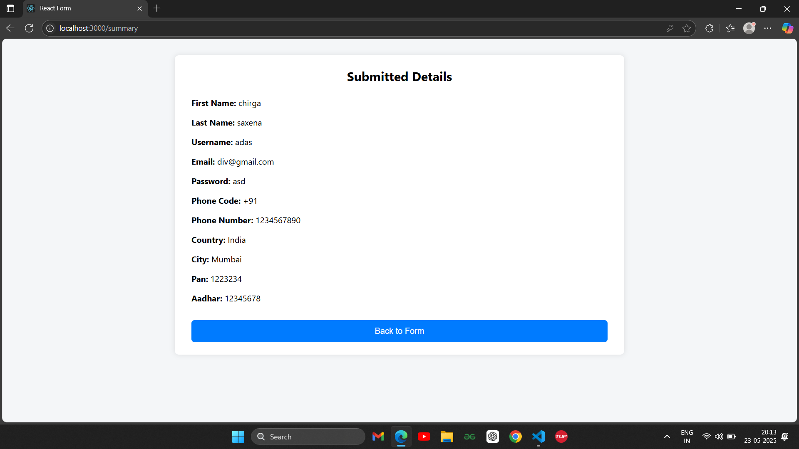

# 📝 React Registration Form with Validation

A responsive and user-friendly React registration form with built-in client-side validation using **only React** (no third-party form libraries). This project ensures that users fill out all required fields correctly before submission, and displays a summary of the submitted data on a new route.

---

## 🚀 Features

✅ Validates form fields without third-party libraries  
✅ Displays inline error messages for invalid/missing inputs  
✅ Disables the submit button until all fields are correctly filled  
✅ Toggles password visibility (show/hide)  
✅ Uses dropdowns for country and city selection  
✅ Displays all submitted details on a new page after successful form submission  
✅ Clean and responsive UI

---

## 📸 Screenshots

### 🧾 Registration Form


### 🛡️ Real-time Validation


### 📄 Submitted Details Page


---

## 🛠️ Technologies Used

- React
- React Router DOM
- CSS
- JavaScript

---

## 🧩 Form Fields

- First Name
- Last Name
- Username
- Email
- Password (with Show/Hide)
- Phone Number (with Country Code)
- PAN Number
- Aadhar Number
- Country (Dropdown)
- City (Dropdown based on country selection)

---

## 📁 Folder Structure

```
src/
├── components/
│   ├── Form.js
│   ├── Summary.js
│   └── ...
├── App.jsx
├── index.js
├── index.css
└── ...
```
